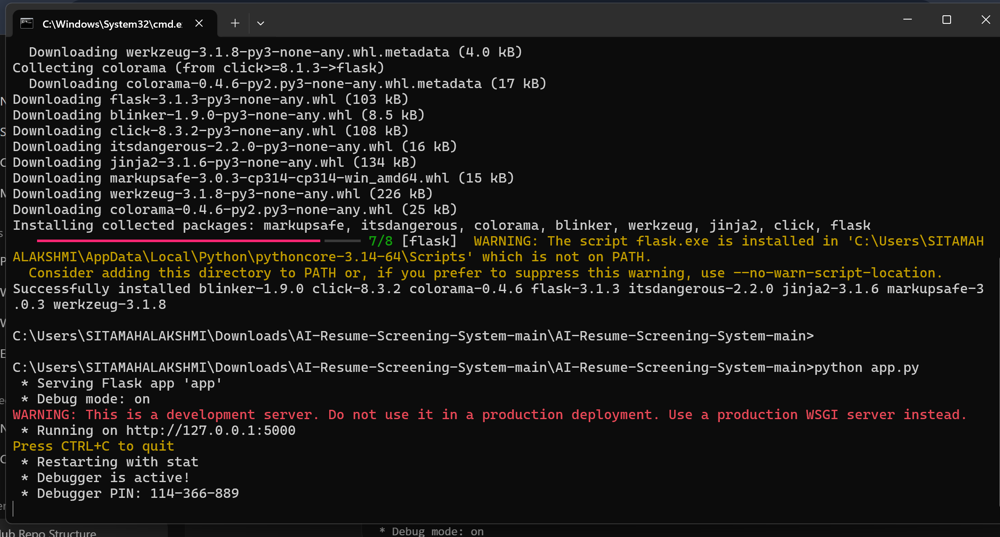
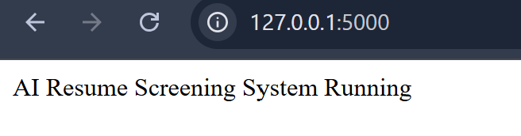
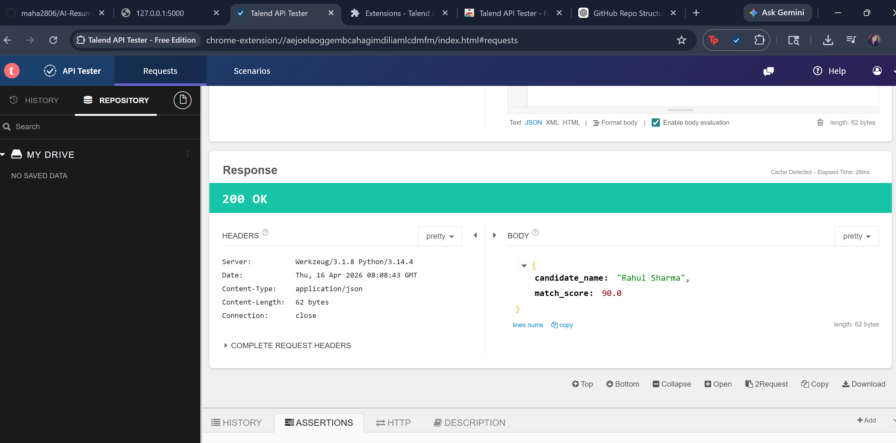

# 🚀 AI-TalentScan: AI-Powered Resume Screening and Candidate Shortlisting System

> An AI-based system for automated resume screening and candidate matching.

---

## 📌 Project Overview

AI-TalentScan is an AI-powered recruitment platform that automates resume screening by analyzing candidate resumes and matching them with job descriptions. The system extracts candidate skills, calculates compatibility scores, and assists HR professionals in efficiently shortlisting suitable candidates using Natural Language Processing (NLP) and Machine Learning techniques.

---

## 🚀 Features

- Resume Parsing using NLP
- Skill Extraction
- Candidate Matching Algorithm
- Automated Candidate Scoring

---

## 🛠️ Tech Stack

| Technology | Description |
|------------|-------------|
| Python | Backend Programming Language |
| Flask | REST API Framework |
| spaCy & NLTK | Natural Language Processing |
| JSON | Data Storage and API Communication |

---

## ⚙️ Setup Instructions

### Install Dependencies

```bash
pip install -r requirements.txt
```

### Run the Application

```bash
python app.py
```

### Test the API

Use **Postman** or any REST client.

**Endpoint**

```http
POST /match
```

---

## 📊 Sample Input

```json
{
  "name": "Rahul Sharma",
  "skills": [
    "Python",
    "SQL",
    "Machine Learning"
  ],
  "experience": 2
}
```

---

## 📈 Sample Output

```json
{
  "candidate_name": "Rahul Sharma",
  "match_score": 85.0
}
```

---

## 📸 Screenshots

### API Running



### Open Browser



### Match Result



---

## 📂 Project Structure

```
AI-TalentScan-Resume-Screening-System/
│
├── docs/
├── sample_data/
├── screenshots/
├── app.py
├── matcher.py
├── data_generator.py
├── requirements.txt
├── README.md
└── .gitignore
```

---

## 🎯 Applications

- Resume Screening
- Candidate Shortlisting
- Recruitment Automation
- HR Talent Acquisition

---

## 👨‍💻 Developer

**Ganesh Sonawane**

Master of Computer Applications (MCA)

---

## 📄 License

This project is developed for educational and academic purposes as part of an MCA Final Year Project.
